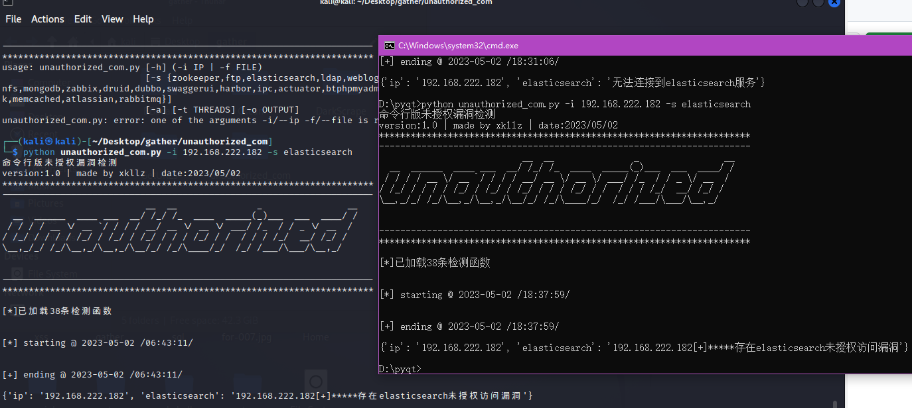

# unauthorized_py
# 说明
这是一个自动检测未授权漏洞工具
# 使用
git clone https://github.com/xk11z/unauthorized_com.git 

cd unauthorized_com

apt-get install python3-pip  

pip install -r requirements.txt 

python3 unauthorized_com.py

# 项目截图

可设置线程，检测单个服务

# 免责声明
本工具仅面向合法授权的企业安全建设行为，如您需要测试本工具的可用性，请自行搭建靶机环境。 在使用本工具进行检测时，您应确保该行为符合当地的法律法规，并且已经取得了足够的授权。请勿对非授权目标进行扫描。 如您在使用本工具的过程中存在任何非法行为，您需自行承担相应后果，我们将不承担任何法律及连带责任。
